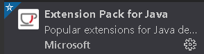
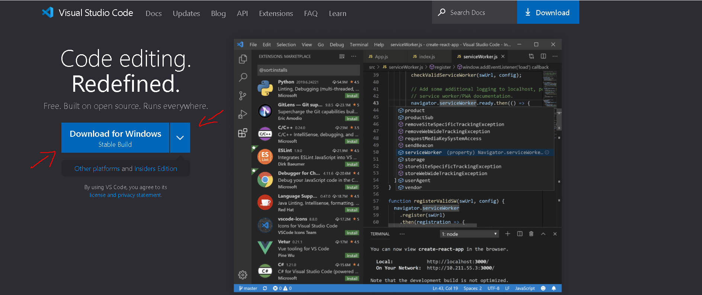
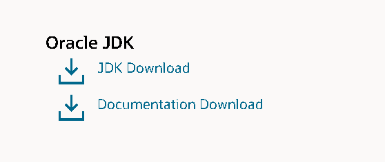
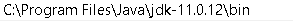
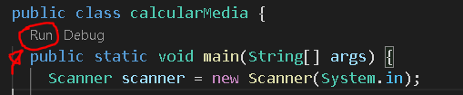

# **🚧HELLO JAVA** 🚀 #
Foco desse repositorio é postar os code e exercicios Java que fizemos e estamos aprendendo .

# **EXTENSÕES CASO USE ( VS CODE )**  # 

<a href="https://marketplace.visualstudio.com/items?itemName=vscjava.vscode-java-debug">Debugger for Java</a>

 

<a href="https://marketplace.visualstudio.com/items?itemName=vscjava.vscode-java-pack" >Extension Pack for Java</a>

# **⚙️COMO CONFIGURAR O AMBIENTE**

<strong>1 VOCÊ DEVE INSTALAR O VISUAL CODE</strong>

 

<strong>2° VOCÊ DEVE INSTALAR O  JDK</strong>

 
 

<strong>3° VARIÁVEL DE AMBIENTE</strong>
 
Você vai precisar criar uma variável de ambiente pro JDK é bem simples Botão Win depois pesquisa "variável de ambiente" clica depois vai em Avançado logo em baixo vai ter "Variáveis de ambiente" clique vai abrir uma tela vai em "Variaveis do sistema" procure por "Path" selecione editar vai em novo e bota o caminho do bin do seu JDK segue imagem abaixo: 
 

Caso precise de ajuda para instalar o JDK <a href="https://www.youtube.com/watch?v=X8AnVQ-GqLU&t=300s&ab_channel=CFBCursos">clique aqui.</a>

# **RODAR O PROJETO** ##
Depois de ter seguido os passos acima ao iniciar um projeto Java irá aparecer isso em sua tela: 

 

Prontinho tudo funcionando! caso não queira instalar nada em sua maquina utilize um compilador online como ó <a href="https://www.onlinegdb.com/online_java_compiler">onlinegdb</a>
