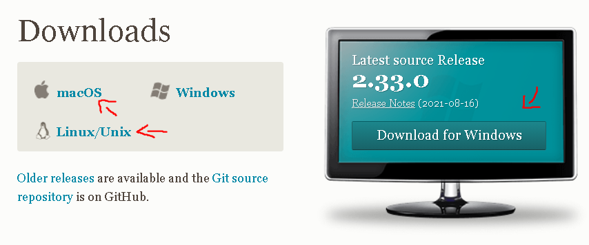
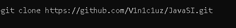

# **🚧HELLO JAVA** 🚀 #
Foco desse repositorio é postar os code e exercicios Java que fizemos e estamos aprendendo .

# **⚙️COMO CONFIGURAR O AMBIENTE**

<strong>1 VOCÊ DEVE INSTALAR O VISUAL CODE (CASO NÃO TENHA) </strong>

 

<strong>2° VOCÊ DEVE INSTALAR O  JDK</strong>

 
 

<strong>3° VARIÁVEL DE AMBIENTE</strong>
 
Você vai precisar criar uma variável de ambiente pro JDK é bem simples Botão Win depois pesquisa "variável de ambiente" clica depois vai em Avançado logo em baixo vai ter "Variáveis de ambiente" clique vai abrir uma tela vai em "Variaveis do sistema" procure por "Path" selecione editar vai em novo e bota o caminho do bin do seu JDK segue imagem abaixo: 
 

Caso precise de ajuda para instalar o JDK <a href="https://www.youtube.com/watch?v=X8AnVQ-GqLU&t=300s&ab_channel=CFBCursos">clique aqui.</a>

# **EXTENSÕES CASO USE ( VS CODE )**  # 

<a href="https://marketplace.visualstudio.com/items?itemName=vscjava.vscode-java-debug">Debugger for Java</a>

 

<a href="https://marketplace.visualstudio.com/items?itemName=vscjava.vscode-java-pack" >Extension Pack for Java</a>

# **🏃RODAR O PROJETO** ##
Depois de ter seguido os passos acima ao iniciar um projeto Java irá aparecer isso em sua tela: 

 

Prontinho tudo funcionando! caso não queira instalar nada em sua maquina utilize um compilador online como ó <a href="https://www.onlinegdb.com/online_java_compiler">onlinegdb</a>

# **📋CLONAR O PROJETO PARA SUA MÁQUINA**

<h2 style="font-weight: bolder">SEM GIT</h2>
Caso não queira baixar o git (Não recomendado). 

Vai em code e clique em Download ZIP, extraia o zip na pasta que deseja e pronto já pode começar a codar!

<h2 style="font-weight: bolder">COM GIT</h2>

Caso você não tenha o git <a href="https://git-scm.com/downloads">clique aqui.</a>
Selecione o Download conforme o seu sistema operacional.

<h2 style="font-weight: bolder">APÓS INSTALAR</h2>

Vai na pasta que deseja que fique seu projeto abra o terminal use o comando **git clone https://github.com/V1n1c1uz/JavaSI.git** aperte ENTER e pronto já pode começar a codar!

# **📂CODES E EXERCÍCIOS** #

Basta abrir a pasta src que está tudo lá de maneira organizada.

**CODE - TUDO QUE NÃO SEJA EXERCÍCIOS | EXEMPLOS ETCS...**

- exemploWhile.java
- exemploSwitch.java

#

**EXERCÍCIOS - PASSADO PELO PROFESSOR OU PARA SEU ESTUDO**

- VA1.java
- exercicio9.java
- exercicio10.java
- exercicio11.java
- exercicio12.java
- exercicio13.java
- exercicio14.java
#
